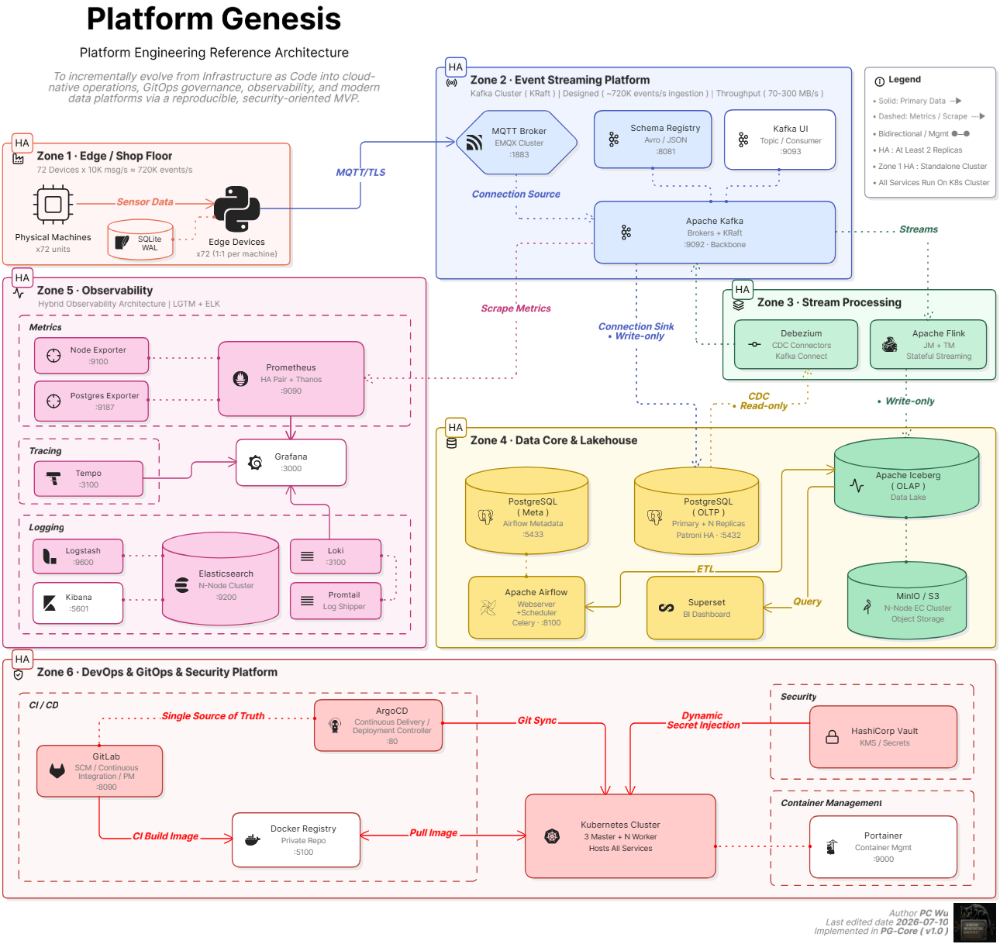
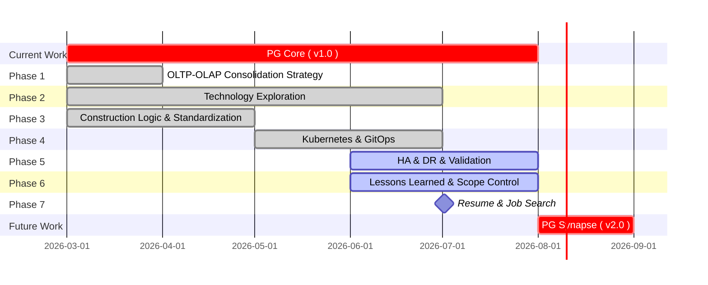

<a href='https://github.com/Junwu0615/Platform Genesis'>

## *⭐ Platform Genesis Core ( v1.0 ) ⭐*

 

### *A.　PG Core Structure*
|*Project Name*|*Responsibilities*|*Tech Stack*|
|:--|:--|:--|
| [_**Platform Genesis**_](https://github.com/Junwu0615/Platform-Genesis) | _**Homepage :** Construction Records & Quantitative Testing_ | - |
| [_**PG-Infrastructure**_](https://github.com/Junwu0615/PG-Infrastructure) | _**IaC & Automation :** Orchestrates environment lifecycles via Terraform, Ansible, and Makefiles._ | `GKE` `Kubernetes` `Docker` `Terraform` `Ansible` `Makefile` |
| [_**PG-APP-Core**_](https://github.com/Junwu0615/PG-APP-Core) | _**Business & Stream Logic :** Core engine for multi-version factory simulations, stream processing, and data infrastructure optimization._ | `PG-Shared-Lib` `Python` |
| [_**PG-Shared-Lib**_](https://github.com/Junwu0615/PG-Shared-Lib) | _**Core Library :** Provides standardized, high-reusability modules across the ecosystem._ | `EntryPoint` `Logger` `MqttServer` `KafkaConsumerManager` `KafkaProducerManager` |
| [_**PG-Edge-Container**_](https://github.com/Junwu0615/PG-Edge-Container) | _**Edge Deployment :** Lightweight IoT units for data acquisition and real-time MQTT/SQLite HA processing._ | `PG-APP-Core` `MQTT` `SQLite` |
| [_**PG-Airflow-DAGs**_](https://github.com/Junwu0615/PG-Airflow-DAGs) | _**Data Orchestration :** Manages ETL pipelines, data lineage, and OLTP-to-OLAP transformations._ | `Airflow` `DAGs` |

  

### *B.　Project Progress*

<b><i>　b.2.1　Project Journey </i></b>

<ul>

|**Item**|**Description**|**Time**|
|--:|:--|:--:|
| Create Project | - | 2026-03-20 |
| Define Process | - | 2026-03-20 |
| Define Event Story | - | 2026-03-21 |
| Define Project Directory | - | 2026-03-21 |
| Define Table DDL | - | 2026-03-21 |
| Redefine Project Name | _**OLTP-OLAP-Unified-DB** to **Platform Genesis**_ | 2026-05-08 |
| Project Breakdown | _**5 Major Categories**_ | 2026-05-08 |
| _**[Architecture Diagram v1.0](./assets/png/Architecture-Diagram-v1.0.png)**_ | - | 2026-05-16 |
| _**[Architecture Diagram v2.0](./assets/png/Architecture-Diagram-v2.0.png)**_ | - | 2026-06-14 |
| _**[Architecture Diagram v2.1](./assets/png/Architecture-Diagram-v2.1.png)**_ | - | 2026-06-22 |
| _**[Architecture Diagram v2.2](./assets/png/Architecture-Diagram-v2.2.png)**_ | - | 2026-06-30 |
| _**[Architecture Diagram v3.0](./assets/png/Architecture-Diagram-v3.0.png)**_ | - | 2026-07-04 |
| _**[Architecture Diagram v3.1](./assets/png/Architecture-Diagram-v3.1.png)**_ | - | 2026-07-06 |
| _**[Architecture Diagram v3.2](./assets/png/Architecture-Diagram-v3.2.png)**_ | - | 2026-07-10 |
| _**PG-Analytics**_ | - | 2026-07-04 |
| _**PG-Core v1.0**_  | _Sprint **2026-03** to **2026-07**_ | 2026-07-XX |
| _**PG-Synapse v2.0**_ | _**Planning**_ | _**Future Work**_ |
| _**PG-Cortex v3.0**_ | _**Planning**_ | _**Future Work**_ |
| _**PG-Sentinel v4.0**_ | _**Planning**_ | _**Future Work**_ |
| _**Pause**_ | _After **2026-07**_ | 2026-07-XX |

</ul>

<b><i>　b.2.2　Code </i></b>

<ul>

|**Item**|**Description**|**Time**|
|--:|:--|:--:|
| Create OLTP DDL | 3NF `6` | 2026-03-21 |
| Script | delete_data.py | 2026-03-24 |
| Script | drop_table.py | 2026-03-24 |
| Script | factory_config.yaml | 2026-03-24 |
| Script | init_factory_data.py | 2026-03-24 |
| Script | simulate_factory_stream.py | 2026-03-24 |
| Single to Batch Insert | batch sending | 2026-03-26 |
| Generate Rigorous Static Data | - | 2026-03-26 |
| Rigorous Calibration of Dynamic Data | 單一機台同時間只允許做一件事 / 排隊消化訂單 / 訂單生產週期戳記 | 2026-03-27 |
| Adjusting Contextual | ~~insert machine event : machine_events~~ | 2026-03-28 |
| execute ➔ execute_batch | batch sending + batch submission : 不適用於目前模擬方式 | X |
| Adjusting Contextual | insert machine status : machine_status_logs | 2026-03-30 |
| Increase Data Volume | - | 2026-03-30 |
| Create OLAP DDL | Star Schema `5` | 2026-04-06 |
| Auto Partition | `dags/sql/auto_partition/*` | 2026-04-06 |
| OLTP to OLAP | `dags/sql/*` | 2026-04-06 |
| DAG | Build Coding Style | 2026-04-06 |
| DAG ETL Script | Fan-out Queue Pattern | 2026-04-06 |
| DAG | Try `Param` | 2026-04-07 |
| DAG | Try `Dataset` | 2026-04-08 |
| Docker Compose | Compose Modularization | 2026-04-11 |
| Add Makefile | for `docker-compose` | 2026-04-11 |
| Add Airflow Config UI | `Trigger w/ Config` | 2026-04-18 |
| DAG | update Coding Style | 2026-04-18 |
| Add Makefile | for `terraform + ansible` | 2026-04-19 |
| Terraform | Modularization | 2026-04-20 |
| Ansible | Modularization | 2026-04-20 |
| Simple Simulation | organizing old versions : `v1` | 2026-04-28 |
| API Service logic | - | X |
| Multi-Instance | like real-edge : `v2` | 2026-04-28 |
| MQTT logic | for `cp` | 2026-04-28 |
| Kafka Connect | `source` : Producer  | 2026-04-30 |
| Kafka logic | for `inst` | 2026-05-03 |
| Kafka Connect | `sink` : Consumer | 2026-05-04 |
| Define the Version Number of each service  | settings to `.env` | 2026-05-05 |
| logging logic | mixed ( `ELK` + `logging` ) | 2026-05-06 |
| Encapsulation Entry | app.py | 2026-05-06 |
| logging logic | Logs Correct Paths Based on Module Calls | 2026-05-07 |
| update `v2` logic | Apply the New Underlying Module | 2026-05-07 |
| Import Shared Lib | - | 2026-05-13 |
| Add `SQLite` to Edge scripts  | Improve the HA of Consumer Transactions | 2026-05-13 |
| loki logic | - | 2026-05-14 |
| `IS_KUBERNETES` | Boolean Injection Forced Type Configuration | 2026-05-14 |
| make `v2` Dockerfile | - | 2026-05-14 |
| lint `CI` | Automatic Detection Before Push `.pre-commit-config.yaml` | 2026-05-18 |
| lint `CI` | Syntax Checking `black` `flake8` | 2026-05-18 |
| test `CI` | common tests scripts | 2026-05-18 |
| build `CI` | - | 2026-05-19 |
| deploy `CD` | - | 2026-05-20 |
| Python-Tempo Logic | `observational_simulation` | 2026-07-10 |
| Grafana Dashboard | `templates/grafana/observability.json` | 2026-07-10 |
| DAG | `init.py` + `create_topic.py` | _**PG-Synapse v2.0**_ |
| `TDD` | *Test-Driven Development* 測試驅動開發 `Pytest` `Mocking` | _**PG-Synapse v2.0**_ |
| `DTT` | *Decision Table Testing* 判定表測試 `Integration Testing` | _**PG-Synapse v2.0**_ |
| `TBD` | *Trunk-Based Development* 主幹開發模式 `Feature Flags` | _**PG-Synapse v2.0**_ |
| `BDD` | *Behavior-Driven Development* 行為驅動開發 | _**PG-Synapse v2.0**_ |
| `shared` logging | 日誌渲染更新 `rich` | _**PG-Synapse v2.0**_ |
| `shared` packages | 腳本頂部路徑初始化封裝 | _**PG-Synapse v2.0**_ |
| Create MV | Materialized View | _**PG-Synapse v2.0**_ |
| Analytical Queries | - | _**PG-Synapse v2.0**_ |
| Grafana Dashboard | `templates/grafana/htap.json` | _**PG-Synapse v2.0**_ |
| Security Message |  _Message Queue Layer_ Encryption ( `kafka` + `mqtt` ) | `TBD` |
| Security Message |  _Software Layer_ Asymmetric encryption | `TBD` |

</ul>

<b><i>　b.2.3　Infra </i></b>

<ul>

|**Item**|**Description**|**Time**|
|--:|:--|:--:|
| Add `PostgreSQL` | - | 2026-03-20 |
| Add `Airflow` | for `OLAP` | 2026-03-21 |
| Add `PoWA` | for `Monitoring` | 2026-03-23 |
| Docker Engine | for `WSL2` | 2026-04-03 |
| Add `Monitoring` | `Postgres Exporter` | 2026-04-04 |
| Add `Monitoring` | `Prometheus` | 2026-04-04 |
| Add `Monitoring` | `Grafana` | 2026-04-04 |
| Add `Monitoring` | `Node Exporter` | 2026-04-05 |
| Add `Portainer` | for `Manage Containers` | 2026-04-11 |
| Add `IoT Platform` | `MQTT Broker` | 2026-04-25 |
| Add `IoT Platform` | `Apache Kafka` | 2026-04-25 |
| Add `ELK` | for `Manage Log` | 2026-05-05 |
| Kubernetes | Beginner : `Minikube` | 2026-05-09 |
| Kubernetes | Advanced : `K3d` | 2026-05-10 |
| Kubernetes | Advanced : `K3s` + `VMware` | 2026-05-10 |
| VM | 開源全生命週期自動化堆疊 `Terraform` `Ansible` `libvirt` | 2026-05-10 |
| VM | Terraform 安裝基礎設施 | 2026-05-11 |
| VM | 橫向擴展 Node | 2026-05-12 |
| Add `Monitoring` | `Loki` | 2026-05-12 |
| Add `GitLab` | for `CI` & `Manage Projects` | 2026-05-12 |
| Add `Jenkins` | for `CD` | 2026-05-12 |
| Add `Docker Registry` | for `CI/CD` & `Manage Images` | 2026-05-12 |
| Build `Hierarchical` `Log Management` | `Loki` + `ELK` | 2026-05-14 |
| Build `CD` | `CD` ➔ `Airflow DAGs` | 2026-05-20 |
| VM | Terraform + Ansible `Gateway` | 2026-05-24 |
| Build `WSL2 Homelab` | `Chrome` ➔ `Windows:8080` ➔ `WSL2:80` ➔ `ingress-nginx` | 2026-05-25 |
| Update Migration Matrix | `Hybrid deployment` | 2026-05-26 |
| Add `ArgoCD` | for `CD` | 2026-05-28 |
| Build `GitOps` | `GitLab CI` + `ArgoCD` | 2026-06-05 |
| VM | Terraform + Ansible `Multi-Master` | 2026-06-06 |
| Build `CD` | `CD` ➔ `Edge Container` | 2026-06-13 |
| VM | Ansible `Storge 持久化權限路徑` 設定 | 2026-06-16 |
| VM | Ansible `Keepalived` `VRRP 虛擬 IP ( VIP: 10.88.0.99 )` | 2026-06-16 |
| VM | Ansible `Restructuring`  | 2026-06-21 |
| VM | 預載資源避免 Ansible 卡死外網索取資源 | 2026-06-21 |
| Add `HashiCorp Vault` | Enterprise Key Management System | `202607` |
| Add `Debezium` | Change Data Capture | _**PG-Synapse v2.0**_ |
| Add `Apache Iceberg` | Data Lake | _**PG-Synapse v2.0**_ |
| Add `Apache Flink` | Consumer of CDC | _**PG-Synapse v2.0**_ |
| Add `MinIO` | Object Storage | _**PG-Synapse v2.0**_ |
| Build `Lakehouse` | - | _**PG-Synapse v2.0**_ |
| Add `Superset` | for `OLAP` | _**PG-Synapse v2.0**_ |
| Kubernetes | Bottom Layer : `Kubeadm` + `VMware` | `TBD` |
| Kubernetes | Public Cloud : `GKE` | `TBD` |

</ul>

<b><i>　b.2.4　Experience </i></b>

<ul>

|**Item**|**Description**|**Time**|
|--:|:--|:--:|
| PoWA Web Login Failed | ⚠️no reason found yet | 2026-03-23 |
| DB Settings | Permission Settings | 2026-03-23 |
| New Role | Migration User | 2026-03-24 |
| PoWA( Running Normally ) | - | 2026-03-30 |
| Try Again PoWA Web | ⚠️very difficult to deal with | 2026-03-30 |
| Fine-tuning PostgreSQL Settings | `shm-size` | 2026-04-01 |
| Grafana Dashboard | Organize Observation Indicators | 2026-04-05 |
| WSL2 Settings | `.wslconfig` | 2026-04-06 |
| Partition Settings | `default_partition` | 2026-04-06 |
| Terraform | Declaration Config : `Docker Provider` | 2026-04-19 |
| Terraform | Config Transfer : `docker-compose` | 2026-04-19 |
| Ansible | node `init` & `config` | 2026-04-19 |
| Terraform vs. Compose | `狀態管理差異性 ; 復原配置崩潰 ; 提高 HA` | 2026-04-19 |
| Terraform & Ansible | `Ansible 如何補足 Terraform 的不足` | 2026-04-19 |
| ELK | Build : `ELK` | 2026-05-05 |
| Kubernetes | `Pod` `Node` `Helm` `Kubectl` `Deployment` `Service` `Ingress` `Secret` `ConfigMap` `NameSpaces` `PVC` `SVC` ... | 2026-05-09 |
| Kubernetes | MiniKube | 2026-05-09 |
| Kubernetes | Ansible 初始化節點 | 2026-05-10 |
| Kubernetes | K3d | 2026-05-10 |
| VM | Manual Create Oracle VM | 2026-05-10 |
| VM | 以 Ping 自動喚醒 VM 防止深度睡眠 | X |
| Kubernetes | 簡化 kubectl 指令 | 2026-05-12 |
| Kubernetes | `k9s` | 2026-05-12 |
| CI/CD | Git-Runner | 2026-05-19 |
| CD | 採用 `tar` 流處理對 Airflow 容器 以兩側`記憶體對接灌入達成熱更新` | 2026-05-20 |
| Kubernetes | Win ➔ `Portproxy` ➔ WSL2 | 2026-05-25 |
| Kubernetes | `ingress-nginx` | 2026-05-25 |
| Kubernetes | `OOM Kill` | 2026-05-25 |
| GitOps | update tree `App-of-Apps` | 2026-05-28 |
| GitOps | `Layered GitOps` | 2026-05-29 |
| GitOps | Build : `Observability` `Grafana` | 2026-05-30 |
| GitOps | Build : `Observability` `Prometheus` | 2026-05-30 |
| GitOps | Build : `Observability` `Prometheus Stack` | 2026-05-30 |
| GitOps | Build : `Observability` `Promtail` | 2026-05-31 |
| Helm Chart | `Helm Values 渲染大坑` ➔ 退至穩定版 | 2026-05-31 |
| GitOps | Build : `Observability` `Loki` | 2026-05-31 |
| Kubernetes | `Fluent Bit ( DaemonSet )` | 2026-05-31 |
| GitOps | Build : `Observability` `Tempo` | 2026-06-01 |
| Helm Chart | `values 渲染大法` | 2026-06-03 |
| GitOps | Build : `Databases` `Postgresql` | 2026-06-03 |
| GitOps | `ApplicationSet` | 2026-06-05 |
| GitOps | update tree `Automated Multi-Tenant` `Environment Provisioning` | 2026-06-05 |
| GitOps | Ingress-Nginx `切換 Namespace 環境坑` | 2026-06-06 |
| Kubernetes | 親和/反親合標籤設置 | 2026-06-06 |
| GitOps | Build : `Observability` `Postgres Exporter` | 2026-06-07 |
| GitOps | Build : `Platform` `Registry` | 2026-06-07 |
| Helm Chart | Vanishing 6H `Bitnami 腳本底層對底線 _ 敏感性` | 2026-06-08 |
| GitOps | Build : `PG-Apps` `cp` | 2026-06-10 |
| GitOps | Build : `PG-Apps` `inst` | 2026-06-10 |
| GitOps | Build : `Storage` `nfs` | 2026-06-13 |
| Kubernetes | NFS 儲存機制 ( SQLite ) | 2026-06-13 |
| Kubernetes | `HPA 擴展/縮容` | 2026-06-15 |
| GitOps | `無限套娃動態死鎖` | 2026-06-15 |
| Kubernetes | Master Control Plane `dqlite ( Distributed SQLite / Raft 共識協定 )` | 2026-06-16 |
| Kubernetes + VM | Master Control Plane `控制面組件租約選舉 ( Lease Re-election )` | 2026-06-17 |
| Observability | Loki + Tempo ( Derived fields: Regex ) `超連結格式解析坑` ➔ 用 `Link` 直接組成 | 2026-07-10 |
| Observability | Grafana Alerting 渲染格式坑 ➔ 用 `硬編碼` 直接組成 | 2026-07-10 |
| GitOps | Build : `Security` `Vault` | `202607` |
| GitOps | Maintain 2 repo ( `CI` + `CD` ) | `TBD` |

</ul>

<b><i>　b.2.5　Platform Engineering Deliverables ( PED ) </i></b>

<ul>

|**Item**|**Description**|**Time**|
|--:|:--|:--:|
| _DB Role-Based Access Control_ | _**[PED-1](https://github.com/Junwu0615/Platform-Genesis/blob/main/docs/DB-RBAC.md)**_　➔　`RBAC` `IAM` `Least Privilege` _How can database access be governed securely across teams and environments ?_ | 2026-04-01 |
| _Database Environment Benchmark_ | _**[PED-2](https://github.com/Junwu0615/Platform-Genesis/blob/main/docs/Database-Environment-Benchmark.md)**_　➔　`Docker Desktop` `WSL2` `Windows` `Linux` _How does the runtime environment impact database performance and resource efficiency ?_ | 2026-04-04 |
| _OLTP-OLAP Consolidation Strategy_ | _**[PED-3](https://github.com/Junwu0615/Platform-Genesis/blob/main/docs/OLTP-OLAP-Consolidation-Strategy.md)**_　➔　`HTAP` `CDC` `Schema Sync` _How can analytical workloads be consolidated while minimizing infrastructure cost ?_ | _**PG-Synapse v2.0**_ |
| _Database Query Performance Optimization_ | _**[PED-4](https://github.com/Junwu0615/Platform-Genesis/blob/main/docs/Database-Query-Performance-Optimization.md)**_　➔　`Execution Plan` `Index Strategy` `Latency` _How much performance improvement can be achieved through query optimization ?_ | _**PG-Synapse v2.0**_ |
| _Evolution of Core Data Architecture_ | _**[PED-5](https://github.com/Junwu0615/Platform-Genesis/blob/main/docs/Evolution-of-Core-Data-Architecture.md)**_　➔　`Decoupling` `Scalability` `Consistency` _How should data access architecture evolve as business scale and complexity increase ?  •　Direct Read, MV, and CDC evolution strategies._ | _**PG-Synapse v2.0**_ |
| _Application Workload Performance Analysis_ | _**[PED-6](https://github.com/Junwu0615/Platform-Genesis/blob/main/docs/Application-Workload-Performance-Analysis.md)**_　➔　`Resource Quota` `Throughput` `Saturation` _How can observability data reveal performance bottlenecks and capacity limits ?_ | _**PG-Synapse v2.0**_ |
| _Deployment Delivery Baseline_ | _**[PED-7](https://github.com/Junwu0615/Platform-Genesis/blob/main/docs/Deployment-Delivery-Baseline.md)**_　➔　`GitOps` `App-of-Apps` `Idempotency` _How does GitOps improve deployment efficiency and operational consistency ?_ | 2026-06-13 |
| _Kubernetes Resiliency & Availability Validation_ | _**[PED-8](https://github.com/Junwu0615/Platform-Genesis/blob/main/docs/K8s-Resiliency-Availability-Validation.md)**_　➔　`Fault Injection` `Control-Plane` `Self-Healing` _How resilient is Kubernetes under node, workload, network, and control-plane failures ?_ | 2026-06-16 |
| _Observability Platform Validation_ | _**[PED-9](https://github.com/Junwu0615/Platform-Genesis/blob/main/docs/Observability-Platform-Validation.md)**_　➔　`Logging` `Metrics` `Tracing` `Alert Manager` _How can metrics, logs, traces, and alerts accelerate operational visibility and troubleshooting ?  •　Accelerating operational visibility and troubleshooting._ | 2026-07-21 |
| _Vault Secret Management & Distribution_ | _**[PED-10](https://github.com/Junwu0615/Platform-Genesis/blob/main/docs/Vault.md)**_　➔　`Dynamic Secret` `Encryption` `Zero Trust` _How can secrets be managed, distributed, and rotated securely across Kubernetes workloads ?_ | `202607` |
| _End-to-End DevOps Operating Model_ | _**[PED-11](https://github.com/Junwu0615/Platform-Genesis/blob/main/docs/End-to-End-DevOps-Operating-Model.md)**_　➔　`PR` `Code Review` `TEST` `STAGE` `PROD` _How can development, delivery, operations, and recovery be integrated into a unified platform workflow ?_ | 2026-06-17 |
| _GitOps Deployment Governance Validation_  | _**[PED-12](https://github.com/Junwu0615/Platform-Genesis/blob/main/docs/GitOps-Deployment-Governance-Validation.md)**_　➔　`Drift Detection` `Policy-as-Code` `Traceability` _How can GitOps enforce deployment governance, drift control, and operational traceability ?  •　Enforcing governance and operational traceability._ | 2026-06-21 |

</ul>

  

### *C.　Implement*

<b><i>　Service Support Form </i></b>

<ul>

> ##### 預計實現 ( ✔ )
> ##### 尚未規劃 ( - )
> ##### 經權衡棄用 ( ✘ )
> ##### 經權衡不遷移 ( * ) ➔ 記憶體 OOM Kill ( 折衷打退回為 Docker Compose )
> ##### 經權衡不遷移 ( △ ) ➔ 省作業時間 ( 部分與重型服務 Docker Compose 綑綁 )

|_**Service**_|_**Docker**_|_**Terraform ( Docker )**_|_**MiniKube**_|_**K3d**_|_**K3s**_|_**K3s Migration**_|_**Kubeadm**_|_**GKE**_|
|--:|:--:|:--:|:--:|:--:|:--:|:--:|:--:|:--:|
| _**PostgreSQL**_ | ✔ | - | ✔ | ✔ | ✔ | ✔ | - | - |
| _**PgAdmin**_ | ✔ | ✘ | ✘ | ✘ | ✘ | ✘ | ✘ | ✘ |
| _**PoWA**_ | ✘ | ✘ | ✘ | ✘ | ✘ | ✘ | ✘ | ✘ |
| _**Apache Airflow**_ | ✔ | - | - | - | - | * | - | - |
| _**Superset**_ | ✔ | - | - | - | - | * | - | - |
| _**MQTT**_ | ✔ | - | - | - | - | △ | - | - |
| _**Apache Kafka**_ | ✔ | - | - | - | - | * | - | - |
| _**Kafka UI**_ | ✔ | - | - | - | - | △ | - | - |
| _**Schema Registry**_ | ✔ | - | - | - | - | △ | - | - |
| _**Debezium**_ | ✔ | - | - | - | - | △ | - | - |
| _**MinIO**_ | ✔ | - | - | - | - | △ | - | - |
| _**Apache Iceberg**_ | ✔ | - | - | - | - | * | - | - |
| _**Apache Flink**_ | ✔ | - | - | - | - | * | - | - |
| _**Postgres Exporter**_ | ✔ | ✔ | - | - | - | ✔ | - | - |
| _**Node Exporter**_ | ✔ | ✔ | - | - | - | ✔ | - | - |
| _**Prometheus**_ | ✔ | ✔ | - | - | - | ✔ | - | - |
| _**Grafana**_ | ✔ | ✔ | - | - | - | ✔ | - | - |
| _**Loki**_ | ✔ | - | - | - | - | ✔ | - | - |
| _**Promtail**_ | ✔ | - | - | - | - | ✔ | - | - |
| _**Tempo**_ | ✘ | - | - | - | - | ✔ | - | - |
| _**Elasticsearch**_ | ✔ | - | - | - | - | * | - | - |
| _**Logstash**_ | ✔ | - | - | - | - | * | - | - |
| _**Kibana**_ | ✔ | - | - | - | - | * | - | - |
| _**GitLab**_ | ✔ | - | - | - | - | * | - | - |
| _**Jenkins**_ | ✘ | ✘ | ✘ | ✘ | ✘ | ✘ | ✘ | ✘ |
| _**ArgoCD**_ | ✘ | - | - | - | - | ✔ | - | - |
| _**Harbor**_ | ✘ | ✘ | ✘ | ✘ | ✘ | ✘ | - | - |
| _**Docker Registry**_ | ✔ | - | - | - | - | ✔ | - | - |
| _**Docker Registry UI**_ | ✘ | ✘ | ✘ | ✘ | ✘ | ✘ | ✘ | ✘ |
| _**Portainer**_ | ✔ | ✔ | - | - | ✔ | ✔ | - | - |
| _**HashiCorp Vault**_ | ✔ | - | - | - | - | ✔ | - | - |

</ul>

  

### *D.　Lessons Learned & Evolution*
> *Platform Genesis began as an attempt to address a practical data*
> *infrastructure challenge: consolidating OLTP and OLAP workloads*
> *into a unified architecture.*
>
> *As the project evolved, the scope naturally expanded beyond data*
> *engineering into infrastructure automation, Kubernetes operations,*
> *GitOps workflows, observability, secret management, and reliability*
> *validation.*
>
> *Through continuous implementation and validation, the project*
> *gradually shifted from technology exploration toward architecture*
> *convergence and operational standardization.*
>
> *The most important lesson learned was that building individual*
> *components is relatively straightforward; integrating them into a*
> *maintainable, highly available, and operationally sustainable*
> *platform is significantly more challenging.*
>
> *As a result, the current focus has shifted from expanding the*
> *technology stack to improving reliability, reducing operational*
> *complexity, and establishing production-oriented engineering*
> *practices.*

 

|*Category*| *Service & Tech Stack*|
|--:|:--|
|*Data Core*|      |
|*Orchestration* |   |
|*Event Streaming* |    |
|*Lakehouse* |     |
|*Monitoring* |     |
|*Log Management*|    |
|*Cloud & Infra*|      |
|*DevOps & Security* |       |
|*Other*|     |

 

[//]: # (> &#40; Mar 2026 – Jul 2026 &#41;)
> ##### *Platform Engineering Learning Sprint ( Mar 2026 – Present )*

   